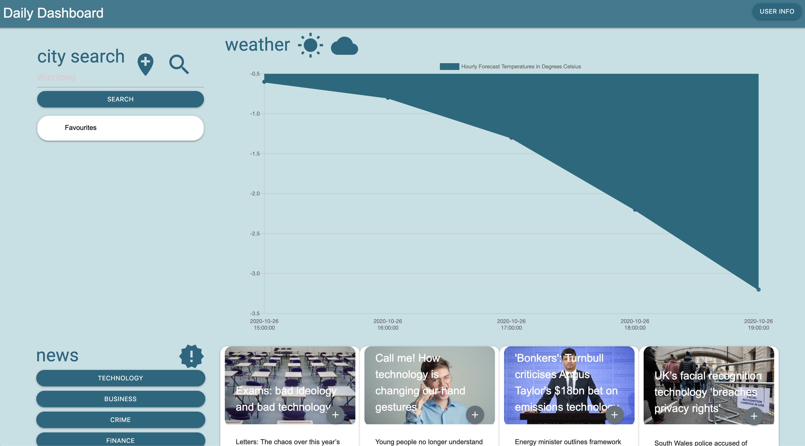

# Daily-Dashboard

## This WebApp allows a user to see the some Weather information and a few News Headlines in a simple single page design. It can provide some information that can prove useful in planning a work day or a trip

**Included technologies / resources:**
1. HTML
2. CSS
3. Javascript
4. JQuery
5. moment.js
6. materialize.css
7. Guardian News API
8. OpenWeather API

**Key Features:**
1. User is prompted to provide their name and current city on their first visit to the WebApp. (in development)
2. This information is used to provide a warm greeting on the banner at the top of the page and to get weather for the user provided city. (in development)
3. Cities provided to the weather search are stored to a history/favourites list for easy recall and to localstorage for reloads of the WebApp or return visits to the page.
4. A beautiful graph showing the forecasted maximum temperatures for the next 5-Days.
5. User can request news in one of five (5) categories by clicking the appropriate button in the news section. This will fetch and present the top four (4) news articles in that category from the Guardian News API for TODAY (user's current day) on a carousel, two articles at a time. Clicking a News Category button replaces the currently loaded articles with content returned from a new fetch.
6. When a user selects a News Category, the selected News Category is saved to localstorage. The news is then fetched and presented as four (4) cards using this News Category. On reloads/revisits of the to the page the saved recent news category and presented autmatically. If there is no data for recent News Category in localstorage, a message is displaed asking the user to select a News Category.

Application URL: https://leggeamy.github.io/Daily-Dashboard/

Application image: 