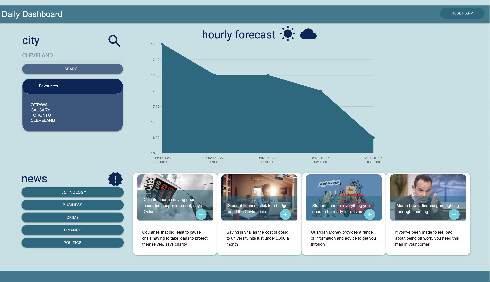

# Daily-Dashboard

## This WebApp allows a user to see the some Weather information and a few News Headlines in a simple single page design. It can provide some information that can prove useful in planning a work day or a trip

**Included technologies / resources:**
1. HTML
2. CSS
3. Javascript
4. JQuery
5. moment.js
6. materialize.css
7. Guardian News API
8. WeatherBit API
9. charts.js

**Key Features:**
1. Searching a city will a beautiful graph showing the forecasted hourly temperature changes.
2. The **Collapsible** Favourites section will store up to a maximum of five (5) recently searched cities.
3. Clicking on a favourite will display weather for that favourite
4. User can request news in one of five (5) categories by clicking the appropriate button in the news section. This will fetch and present the top four (4) news articles in that category from the Guardian News API for TODAY (user's current day). Clicking a News Category button replaces the currently loaded articles with content returned from a new fetch.
5. On reloads/revisits of the to the page, data for the most recently selected news category and most recent searched city are presented automatically. If there is no data for recent News Category in localstorage, a message is displayed asking the user to select a News Category and / or to search a city.
6. User can click the "Reset App" button to clear the screen of all displayed items and clear localstorage of all saved data.

**Features for future consideration**
1. User is prompted to provide their name and current city on their first visit to the WebApp.
2. Request access to user's location and use it prepopulate the weather forecast
3. Create a second page where user can "free search" news articles, not restricted to the initial five (5) categories we provide.

Application URL: https://leggeamy.github.io/Daily-Dashboard/

Application image: 

**TeamOne:**
1. Amy Legge
2. Tomasso D'Odidio
3. Sterlyn Kong
